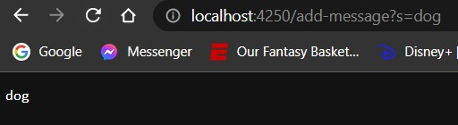
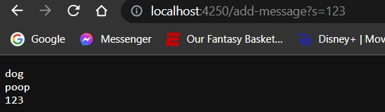
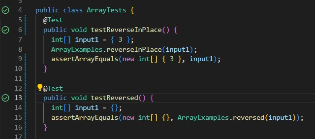

# CSE 15L Lab Report 2: Servers and Bugs

## Part 1:

StringServer.java Code:

```
import java.io.IOException;
import java.net.URI;

class Handler implements URLHandler {
    // The one bit of state on the server: a number that will be manipulated by
    // various requests.
    String opt = new String();

    public String handleRequest(URI url) {

        if (url.getPath().equals("/")) {
            return String.format("Add to Path");
        } else {
            System.out.println("Path: " + url.getPath());
            if (url.getPath().contains("/add-message")) {
                String[] parameters = url.getQuery().split("=");
                if (parameters[0].equals("s")) {
                    opt += parameters[1];
                    opt += "\n";
                    System.out.println(opt);
                    return opt;
                }

            }
            return "Error 401!";
        }
    }
}

class StringServer {
    public static void main(String[] args) throws IOException {
        if (args.length == 0) {
            System.out.println("Missing port number! Try any number between 1024 to 49151");
            return;
        }

        int port = Integer.parseInt(args[0]);

        Server.start(port, new Handler());
    }
}
```
Output:





Methods Called: Within the handleRequest `getPath()`, `getQuery()` were used

`getPath()` - gets the entire path of the URI

`getQuery()` - gets postion of the URI after the question mark

Arguments: No arguments are needed for the methods

Values: 

`getPath()` - returns a string of the path of the URI

`getQuery()` - returns a string of the Query

The String `opt` continues to get updated with new Queries entered. This value is returned for the handleRequest method.

Inputing any time of data type will return a String casted version of that data type in the reference `opt`

## Part 2:

Error in ArrayExamples in java found using JUnit testing:


The failure inducing input in this case is an Array of length 3 containing non-null values:

```
int[] input = new int[]{ 1, 2, 3 };
```

The non-failure inducing input is any input that is on length 0 or 1:



```
int[] input = new int[]{}
```

As shown above the outputs are:


The Bug Before and After:

Before:
```
// Changes the input array to be in reversed order
  static void reverseInPlace(int[] arr) {
    for(int i = 0; i < arr.length; i += 1) {
      arr[i] = arr[arr.length - i - 1];
    }
  }

  // Returns a *new* array with all the elements of the input array in reversed
  // order
  static int[] reversed(int[] arr) {
    int[] newArray = new int[arr.length];
    for(int i = 0; i < arr.length; i += 1) {
      arr[i] = newArray[arr.length - i - 1];
    }
    return arr;
  }
```

After:
```
 // Changes the input array to be in reversed order
  static void reverseInPlace(int[] arr) {
    
    for(int i = 0; i < (arr.length)/2; i++) {
        int temp = arr[i];
        arr[i] = arr[arr.length-i-1];
        arr[arr.length-i-1] = temp;
      }
  }

  // Returns a *new* array with all the elements of the input array in reversed
  // order
  static int[] reversed(int[] arr) {
    int[] newArray = new int[arr.length];
    for(int i = 0; i < arr.length; i += 1) {
      newArray[i] = arr[arr.length-i-1];
    }
    return newArray;
  }
  ```
  The bug was the fact that reverseInPlace() does properly overwrite all the values as there is no memory allocation for the values that were already overwritten.
  
  ## Part 3:
  
  Something I learned these past two weeks was how to create a local server and implement query methods in java
  
  I also was able to learn the certain keywords used when debugging programs, making it easier for me to communicate any problems.


