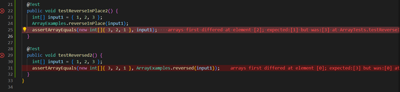

# CSE 15L Lab Report 2: Servers and Bugs

## Part 1:

StringServer.java Code:

```
import java.io.IOException;
import java.net.URI;

class Handler implements URLHandler {
    String opt = new String();

    public String handleRequest(URI url) {
        if (url.getPath().equals("/")) {
            return String.format("Add to Path");
        } else {
            System.out.println("Path: " + url.getPath());
            if (url.getPath().contains("/add-message")) {
                String[] parameters = url.getQuery().split("=");
                if (parameters[0].equals("s")) {
                    opt += parameters[1];
                    opt += "\n";
                    System.out.println(opt);
                    return opt;
                }

            }
            return "Error 401!";
        }
    }
}

class StringServer {
    public static void main(String[] args) throws IOException {
        if (args.length == 0) {
            System.out.println("Missing port number! Try any number between 1024 to 49151");
            return;
        }

        int port = Integer.parseInt(args[0]);

        Server.start(port, new Handler());
    }
}
```
Output:


Methods Called: Within the handleRequest `getPath()`, `getQuery()` were used

`getPath()` - gets the entire path of the URI

`getQuery()` - gets portion of the URI/path after the question mark. It varies based on user input, with the webpage appropriately updating based on the query

Arguments: No arguments are needed for the methods

Although there are no arguments for the `getPath()` and `getQuery()` methods, the `handleRequest(URI url)` method uses an argument

`handleRequest(URI url)` - Uses URI type argument which it is able to parse using `getPath()` and `getQuery()` to get the path and query parameters

Values: 

`getPath()` - returns a string of the path of the URI

`getQuery()` - returns a string of the Query

The String `opt` continues to get updated with new Queries entered. This value is returned for the handleRequest method.

In the second screenshot, the final iteration of the value of `opt` ends up being `"dog/npoop/n123"`

Inputing any time of data type will return a String casted version of that data type in the reference `opt`

## Part 2:

Error in ArrayExamples in java found using JUnit testing:



The failure inducing input in this case is an Array of length 3 containing non-null values:

```
int[] input = new int[]{ 1, 2, 3 };
```

The non-failure inducing input is any input that is on length 0 or 1:


```
int[] input = new int[]{}
```

As shown above the outputs are:


The Bug Before and After:

Before:
```
// Changes the input array to be in reversed order
  static void reverseInPlace(int[] arr) {
    for(int i = 0; i < arr.length; i += 1) {
      arr[i] = arr[arr.length - i - 1];
    }
  }

```

After:
```
 // Changes the input array to be in reversed order
  static void reverseInPlace(int[] arr) {
    
    for(int i = 0; i < (arr.length)/2; i++) {
        int temp = arr[i];
        arr[i] = arr[arr.length-i-1];
        arr[arr.length-i-1] = temp;
      }
  }

  ```
  The bug was the fact that reverseInPlace() does properly overwrite all the values as there is no memory allocation for the values that were already overwritten.
  
  If the input was `int[] input = new int[]{ 1, 2, 3 }`, then the output would be `{ 3, 2, 3 }` which is different from the `{ 3, 2, 1 }` we expect.
  
  This is becauase the original data values in the first half of the array were never stored in temporary variables before being overwritten, resulting
  in the array being palindromic and only containig values from the the second half of the array.
  
  To fix this, we only iterated through the first half of the array and stored each value in a temporary variable before overwriting. Through each iteration,
  the array will now overwrite both the first and last elements of the array that have not already been overwritten.
  
  ## Part 3:
  
  Something I learned these past two weeks was how to create a local server and implement query methods in java
  
  I also was able to learn the certain keywords used when debugging programs, making it easier for me to communicate any problems.


