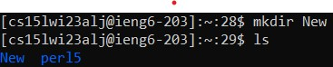

# How to gain Course-Specific Access on `ieng6`

## Finding your personal CSE15L account:
Visit this [link](https://sdacs.ucsd.edu/~icc/index.php) and enter the appropriate information to view your CSE account.

Under the additional accounts section, you should be able to see your account username. It should look something like this:

From there, click on the username and follow the instructions on how to change your password, gaining access to your account.

## Installing Visual Studios:
Follow this [link](https://code.visualstudio.com/) and install Visual Studios Code to your personal computer.

When the installation is complete, open up the application to check to see if everything is working properly.

You should be greeted with a home page similar to this:

## Connecting Remotely:
If you are using a Windows operating system, use this [link](https://gitforwindows.org/) to download git.

Open the terminal and enter the following command to connect remotely:

`$ ssh cs15lwi23zz@ieng6.ucsd.edu`

You will then receive a prompt asking for `(yes/no/fingerprint)`. Enter `yes`. You should then see the following picture:

You should now be good to go to enter any terminal commands learned in class to explore the directory.

For Example:

## Trying Some Commands:
Entering the `pwd` command will print the current working directory. The result should look something like this:

Entering the `ls` command will list out all the directories within the current working directory

We can see that the perl5 directory is listed under the current working directory. 

Let's visit that directory by using the `cd perl5` command and then using `pwd` to check where we are. 

To return back to the home directory use the command `cd ..`.

Again, to check that we are indeed back in the home directory, we can use `pwd` to see the working directory

As you continue to use the remote server, you will grow more familar with other commands as well

The `open <filename>` command will open the desire file in the current working directory

The `cp <filename> <newfilename>` command will create a copy of the first file with the name of the second argument

The `mv <filename> <path>` command will move the file to the path declared by the second argument

The `mkdir <name>` command will create directory/folder with the desired name in the current working directory.

Congratulations! You have connected to the remote server, and now should be able to use terminal commands to navigate around directories.

